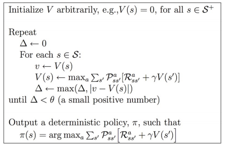

# Code Details for Assignment 3
##Table of Contents
* [Target](#target)
* [Problem Description](#problem-description)
* [Sample Output](#sample-output)
* [Program Requirement](#program-requirement)
* [Marking Scheme](#marking-scheme)
* [Sample Code](#sample-code)

##Target
- Write a program to solve the problem in final page on lecture notes **rl-iterx.pdf**
- Use policy iteration
- Use value iteration

##Problem Description
### The problem 


### Action
- The agent has 4 actions: North, South, West, East
- The agent actions do not always go as planned
  - 
  - with 0.8 probability, it goes as planned
  - with 0.1 probability, it goes left/right relative to the planned direction
  - for example, 
    - with action to go North, it goes North with 0.8 probability, East with 0.1 probability, and West with 0.1 probability; 
    - with action to go West, it goes West with 0.8 probability, North with 0.1 probability, and South with 0.1 probability.

### Reward
- If it would take agent off the grid: **no move but reward = -1**
- If the agent is in A/B, **all actions will take the agent to A'/B'**, and **reward = 10(A to A') or 5(B to B')**
- Other actions produce **reward = 0**

### Note
- When several actions are equally optimal in a state, choose in the order: North, South, West, East

### Parameters
- A(0, 1), A'(4, 1), reward (go out of A): 10
- B(0, 3), B'(2, 3), reward (go out of B): 5
- reward (go out of the grid): -1
- reward (other): 0
- Initial value: 0
- Initial action: always North at all the states
- probability of going as planned (DIR1\_PROBA): 0.8, left/right (DIR2\_PROBA): 0.1
- gamma: 0.9 
- stopping threshold (theta): 0.0001

##Sample output
- The sample output file is in `sample_output/output`. It is **NOT** the true answer.
- First output for policy iteration and then output for value iteration respectively.
- Since we will mark the output by a script, the format of your output should follow the sample output **exactly**.
- Policy names: N(North), S(South), W(West), E(East).

### Policy Iteration

- each iteration consists of Policy Evaluation and Policy Improvement (step 2 and step 3)
- output values and actions after each iteration (after step 3)
- iter 0 is the initial state of the values and actions
- add a blank line between each iteration

```
Policy Iteration

iter: 0
values
0 0 0 0 0 
0 0 0 0 0 
0 0 0 0 0 
0 0 0 0 0 
0 0 0 0 0 
actions
N N N N N 
N N N N N 
N N N N N 
N N N N N 
N N N N N 

iter: 1
values
-9.99915 24.4194 -9.99915 18.4502 -9.99915 
-8.99924 21.9775 -8.99924 16.6052 -8.99924 
-8.09931 19.7797 -8.09931 14.9446 -8.09931 
-7.28938 17.8018 -7.28938 13.4502 -7.28938 
-6.56044 16.0216 -6.56044 12.1052 -6.56044 
actions
E N W N W 
E N W N W 
E N W N W 
E N W N W 
E N W N W 

iter: 2
values
21.9775 24.4194 21.9775 18.4502 16.6052 
19.7797 21.9775 19.7797 16.6052 14.9446 
17.8018 19.7797 17.8018 14.9446 13.4502 
16.0216 17.8018 16.0216 13.4502 12.1052 
14.4194 16.0216 14.4194 12.1052 10.8946 
actions
E N W N W 
N N N W N 
N N N W N 
N N N W N 
N N N W N 

......

iter: 5
values
21.9775 24.4194 21.9775 19.4194 17.4775 
19.7797 21.9775 19.7797 17.8018 16.0216 
17.8018 19.7797 17.8018 16.0216 14.4194 
16.0216 17.8018 16.0216 14.4194 12.9775 
14.4194 16.0216 14.4194 12.9775 11.6797 
actions
E N W N W 
N N N W W 
N N N N N 
N N N N N 
N N N N N 

```


## Value Iteration

- After each iteration, output the delta and values
- iter 0 is the initial state of the values 
- add a blank line between each iteration
- output the final actions in the end

```

Value Iteration

iter: 0
values
0 0 0 0 0 
0 0 0 0 0 
0 0 0 0 0 
0 0 0 0 0 
0 0 0 0 0 

iter: 1
delta: 10
values
0 10 9 5 4.5 
0 9 8.1 7.29 6.561 
0 8.1 7.29 6.561 5.9049 
0 7.29 6.561 5.9049 5.31441 
0 6.561 5.9049 5.31441 4.78297 

...

iter: 23
delta: 0.000141158
values
21.9773 24.4193 21.9774 19.4193 17.4774 
19.7796 21.9774 19.7796 17.8017 16.0215 
17.8016 19.7796 17.8017 16.0215 14.4193 
16.0214 17.8017 16.0215 14.4193 12.9774 
14.4193 16.0215 14.4193 12.9774 11.6797 

iter: 24
delta: 8.33525e-05
values
21.9774 24.4193 21.9774 19.4193 17.4774 
19.7796 21.9774 19.7797 17.8017 16.0215 
17.8017 19.7797 17.8017 16.0215 14.4194 
16.0215 17.8017 16.0215 14.4194 12.9774 
14.4193 16.0215 14.4194 12.9774 11.6797 

final policy: 
actions
E N W N W 
E N N W W 
E N N N N 
E N N N N 
E N N N N 

```

## Program Requirement
- Only c++ standard library can be used.
- Make sure your program can be compiled properly by g++ 4.9. 

## Marking Scheme
- Write programs for  both policy iteration and value iteration.
- The marking scheme is based on both the result (marked by a script) and source code.
- Your code should be well-formatted and clearly commented.
- Plagiarism: All involved parties will get zero mark.


## Sample Code 
- We provide some code fragments
- The files are in the **sample\_code** folder

### Summary of structure
- `Grid` class implements the main algorithm
  - includes a set of `State` objects indexed by row and column numbers
- `State` class implment a state. 
  - inlucdes 4 `Action` objects (N, S, W, E)
- `Action` includes a set of results(`NextState`) triggerd by one action
- `NextState` is a tuple for (next state index, probability, reward)

### main function
```cpp
#include "grid.h"

int main(void) {
  /* create the grid */
  Grid mygrid(5, 5);
  
  /* print the summary */
  mygrid.print();

  /* Policy Iteration */
  mygrid.PolicyIteration();

  /* print the summary */
  mygrid.print();

  /* Value Iteration*/
  mygrid.ValueIteration();

  /* print the summary */
  mygrid.print();
  return 0;
}

```

### Parameter setting

```cpp

#ifndef PARAMETER_H 
#define PARAMETER_H 

/* theta */
#define THETA_DEFALT 0.00001

/* gamma */
#define GAMMA 0.9

/* reward for point A */
#define AREWARD 10 
/* reward for point B */
#define BREWARD 5

/* intial value */
#define VALUE_DEFAULT 0
/* intial policy (North) */
#define POLICY_DEFAULT 0

/* points A and A prime */
#define A_POS StateID(0,1) 
#define AP_POS StateID(4,1) 

/* points B and B prime */
#define B_POS StateID(0,3) 
#define BP_POS StateID(2,3) 

/* probability of going planned direction */
#define DIR1_PROBA 0.8
/* probability of going left/right relative to the planned direction */
#define DIR2_PROBA 0.1

#endif

```

### Grid class 
- The main algorithm class
- The construction of the whole structure is implemented in the constructor.
- You are going to implement the function `PolicyIteration`, `ValueIteration` and the relate functions.

#### The header
```cpp

#ifndef GRID_H 
#define GRID_H

#include "state.h"
#include "parameter.h"
#include<float.h>
#include<cmath>

/* Row of states */
typedef vector<State> StateRow;

class Grid {
 public:
  /* constructor */
  Grid(unsigned row, unsigned col);

  /* Policy Iteration */ 
  void PolicyIteration(void);
  /* Value Iteration */ 
  void ValueIteration(void);
  /* Initialize values and policies */
  void Intialize(void);

  inline double get_state_value(StateID id) const 
  { return states_[id.row][id.col].value(); }

  /* print state information */
  inline void print_state(unsigned row, unsigned col) const 
  { cout << states_[row][col].print_str(); }

  /* print a summary of the whole grid */
  void print(void) const;
  /* print the current policy for the grid */
  void print_policy(void) const;
  /* print the current values for the grid */
  void print_values(void) const;

 private:
  /* Policy Evaluation */
  void PolicyEvaluation(void);
  /* Policy Improvement, return stable*/
  bool PolicyImprovement(void);

  /* generate next states information for state current_id */
  vector<NextState> generate_nextstate(StateID current_id) const;
  /* generate action for a action number for current_id */
  Action generate_action(unsigned action, StateID current_id) const;
   
  bool isingrid(int row, int col) const;
  
  unsigned nrow_, ncol_;
  /* point A A', B B' */
  StateID a_, ap_, b_, bp_;
  /* rewards for A B */
  int a_reward_, b_reward_;
  /* theta */
  double theta_;
  /* gamma */
  double gamma_;
  /* all states */
  /* a state of row i, column j can be accessed by state_[i][j] */
  vector<StateRow> states_;
};

#endif

```

#### The important interfaces
``` cpp

void Grid::Intialize(void) {
  /*
   * add
   */
}

void Grid::PolicyIteration(void) {
  cout << endl << "Policy Iteration" << endl << endl;
  /* 
   * add
   */
  int cnt = 0;


  cout << "iter: " << cnt << endl;
  print_values();
  print_policy();
  cout << endl;
  while(/* add */) {
    /* 
     * add
     */
    cnt++;
    cout << "iter: " << cnt << endl;
    print_values();
    print_policy();
    cout << endl;
  }
}

void Grid::ValueIteration(void) {
  cout << endl << "Value Iteration" << endl << endl;
  int cnt = 0;
  /*
   * add
   */
  cout << "iter: " << cnt << endl;
  print_values();
  cout << endl;
  while (/* add */) {
    /*
     * add
     */ 
    cnt++;
    cout << "iter: " << cnt << endl;
    cout << "delta: " << delta << endl;
    print_values();
    cout << endl;
    /*
     * add
     */
  }

  /* determine policy */
  
  /*
   * add
   */
  cout << "final policy: " << endl;
  print_policy();
  cout << endl;
}


void Grid::PolicyEvaluation(void) {
  /* 
   * add
   */
}

bool Grid::PolicyImprovement(void) {
  /*
   * add
   */
  return stable;
}

```

### Other data structures 
- They are already completed, no need to change

#### header
```cpp

#ifndef STATE_H
#define STATE_H

#include<cstdlib>
#include<vector>
#include<utility>
#include<string>
#include<iostream>
#include<sstream>
#include<algorithm>

#include"parameter.h"

using namespace std;

// row, col
class StateID {
 public:
  /* constructor */
  StateID(unsigned row, unsigned col): row(row), col(col) {}
  /* print string */
  inline string print_str(void) const 
  { ostringstream s; s << "(" << row << ", " << col << ")"; return s.str();}

  unsigned row;
  unsigned col;
};
inline bool operator==(const StateID& lhs, const StateID& rhs) 
{ return ((lhs.row==rhs.row) && (lhs.col==rhs.col)); }


/* a result of an action (state_id, probability, reward)*/
class NextState {
 public:
  NextState(StateID id, double proba, double reward):
      id(id), proba(proba), reward(reward) {}
  
  string print_str(void) const;

  StateID id;
  double proba;
  double reward;
};
/* an action is a set of results */
typedef vector<NextState> Action;


/* state */
class State {
 public:
  /* constructor */
  State(StateID id, vector<Action>& actions): 
      id_(id), actions_(actions), policy_(POLICY_DEFAULT), value_(VALUE_DEFAULT) {}
  
  string print_str(void) const;

  /* get action */
  /* default: action of the current policy */
  inline const Action& get_action(void) const {return actions_[policy_];}
  /* action of the policy dir */
  inline const Action& get_action(unsigned dir) const {return actions_[dir];}

  /* set policy and value */
  inline void set_policy(unsigned policy) {policy_ = policy;}
  inline void set_value(double value) {value_ = value;}

  /* get policy and value */
  inline unsigned policy(void) const  {return policy_;}
  inline double value(void) const  { return value_;}
  
 private:
  /* the state id */
  StateID id_;
  /* the action set (N S W E) */
  vector<Action> actions_;
  
  /* current policy and value */ 
  unsigned policy_;
  double value_;
};

#endif 

```


